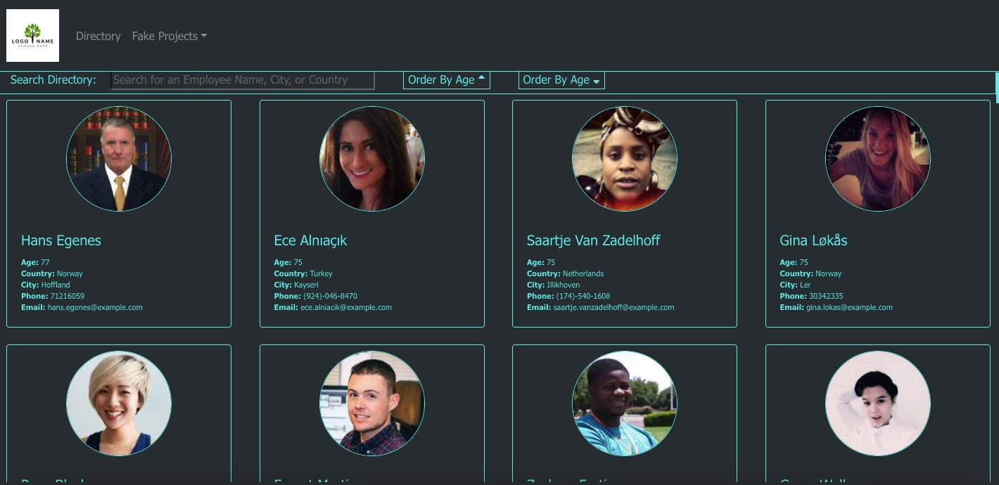

# React Employee Directory

## Table of Contents
* [Installation](#installation)
* [Usage](#usage)
* [License](#license)
* [Questions](#questions)

## Description

This is a employee directory for a fake company to allow the company to see the complete directory of employees. This is displayed as an array of cards to allow for an HR professional to see all the employees that match their criteria.

The randomuser.me API to generates an array of random people objects which are then populated into the application via the Map method on the Employee Card component. Cards are arranged using CSS Grid to ensure responsive design for the grid if the display is collapsed. Bootstrap is used for the styling.

The searchbar uses a dynamic search functionality where it actively searches on change of the text in the search bar based on the employee first name, last name, country, or city. The ordering buttons will reorder the page based on the age of the employee.

Here are pictures of the deployed application
 

## Usage
Go to https://obrienceob.github.io/Employee-Directory/ to use the application

Search by typing in the Search Bar. Sort by age ascending or descending by clicking the buttons. 

Based on selections, employees will populate. 

The dropdown of projects is styled to look more like a webpage under construction, I didn't add in other pages besides the directory.

## License
This repository is licensed under the MIT: (https://opensource.org/licenses/MIT) license.

